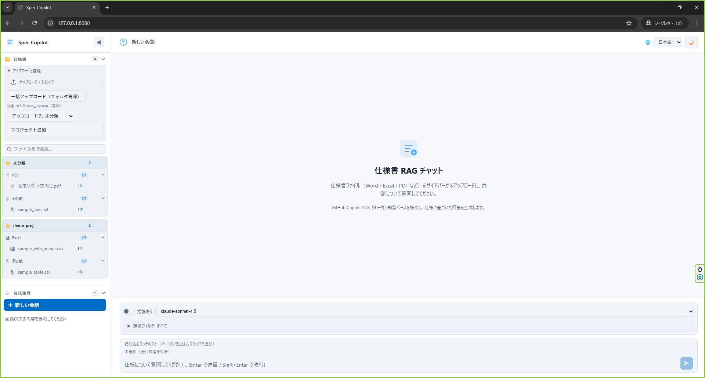
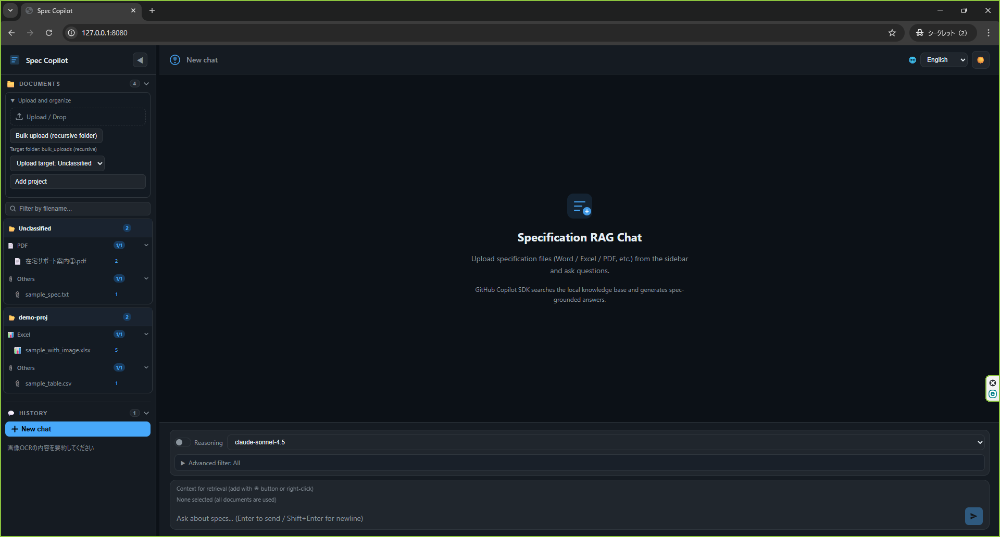

# Spec Copilot

[](#環境要件)
[](https://fastapi.tiangolo.com/)
[](LICENSE)

仕様書ファイルをローカルで管理し、**GitHub Copilot SDK** を使って仕様に基づいた回答を生成する RAG チャットアプリケーションです。  
ChromaDB と SQLite をローカルで利用するため、LLM への外部通信以外は完全にオンプレミスで動作します。

---

## 主な機能

| カテゴリ | 機能 |
|---|---|
| **ドキュメント管理** | 単体/フォルダ一括アップロード、プロジェクト分類、コンテキスト指定 |
| **RAG チャット** | 仕様書を参照した回答生成、retrieval 診断ログ、Query Transform + Reranking |
| **セッション TODO** | 回答内容から AI が TODO テンプレートを生成・管理、承認フロー |
| **UI** | ダーク/ライトモード、日本語/英語切替、ドロワー型 TODO パネル |

---

## スクリーンショット

### ライトモード（日本語）


### ダークモード（英語）


---

## アーキテクチャ

```text
Browser ──HTTP(local)──> FastAPI (app/main.py)
                              │
               ┌──────────────┤
               │              │
           ChromaDB        SQLite
        (data/palace)   (data/history.db)
      ローカル永続         チャット/TODO 履歴
               │
               └──(LLM のみ外部)──> GitHub Copilot SDK
```

| レイヤー | 技術スタック |
|---|---|
| Web / API | FastAPI |
| ドキュメント変換 | markitdown, Pandas, openpyxl, Tesseract OCR (+ 任意: LibreOffice ページ OCR) |
| ベクトル検索 | LangChain + ChromaDB（ローカル永続） |
| 埋め込みモデル | sentence-transformers（ローカルキャッシュ） |
| LLM | GitHub Copilot SDK |
| フロントエンド | Vanilla JS SPA（外部 CDN 不使用） |

---

## 対応拡張子

| 区分 | 拡張子 |
|---|---|
| Office | `.docx`, `.doc`, `.xlsx`, `.xls`, `.pptx`, `.ppt` |
| 文書 | `.pdf`, `.html`, `.htm`, `.md`, `.txt` |
| データ | `.csv`, `.json`, `.xml` |
| 画像 | `.png`, `.jpg`, `.jpeg`, `.gif`, `.bmp`, `.tiff`, `.webp` |
| 図形 | `.drawio`, `.dio` |
| その他 | `.epub`, `.zip` |

---

## 環境要件

- Python 3.12+
- Linux / macOS 推奨（Windows は WSL2 を推奨）

---

## セットアップ

### 1. 自動セットアップ（推奨）

```bash
git clone https://github.com/<your-org>/memplace-spec-copilot.git
cd memplace-spec-copilot
./setup.sh
```

`setup.sh` は仮想環境の作成、依存パッケージのインストール、埋め込みモデルの事前取得を一括実行します。

### 2. 手動セットアップ

```bash
python3 -m venv .venv
source .venv/bin/activate
pip install -r requirements.txt
cp .env.example .env   # 必要に応じて編集
```

### 3. OCR のインストール（Linux）

```bash
sudo apt-get update
sudo apt-get install -y tesseract-ocr tesseract-ocr-jpn tesseract-ocr-eng libreoffice
```

### 4. 起動

```bash
source .venv/bin/activate
uvicorn app.main:app --env-file .env --host 0.0.0.0 --port 8080
```

> `.env` を使わない場合は `--env-file .env` を省略してください。未設定項目は `.env.example` の既定値が使われます。

ブラウザで `http://localhost:8080` を開いてください。

---

## 設定

設定はすべて `.env` ファイルで管理します。`.env.example` を参考に必要な項目を編集してください。

| 変数 | 説明 |
|---|---|
| `COPILOT_MODEL` | 使用する Copilot モデル名 |
| `HISTORY_DB` | チャット / TODO 履歴の SQLite パス |
| `UPLOAD_DIR` | アップロード先ディレクトリ |
| `PALACE_DIR` | ChromaDB 永続ディレクトリ |
| `BULK_UPLOAD_DIR` | 一括アップロード元ディレクトリ |
| `EMBEDDING_MODEL` | 埋め込みモデル名 |
| `EMBEDDING_LOCAL_FILES_ONLY` | `true` でローカルキャッシュのみ参照 |
| `OCR_LANG` | Tesseract の言語指定（例: `jpn+eng`） |
| `ENABLE_VISUAL_PAGE_OCR` | LibreOffice ページ OCR の有効化 |
| `DISABLE_RUNTIME_TELEMETRY` | 各種テレメトリを無効化（既定: `true`） |

---

## GitHub Copilot 認証

本アプリは **GitHub Copilot SDK** を利用します。API キーの手動設定は不要で、GitHub CLI 経由のトークンが自動的に使用されます。

```bash
# GitHub CLI のインストール（未導入の場合）
# https://cli.github.com/

# ログインと Copilot 拡張のインストール
gh auth login
gh extension install github/gh-copilot

# 認証状態の確認
gh auth status
gh copilot --version
```

---

## 使い方

1. **ドキュメントのアップロード**  
   サイドバーの「アップロード / ドロップ」またはフォルダ一括アップロードで仕様書を登録します。

2. **コンテキストの指定**  
   ⊕ ボタンまたは右クリックでファイル・プロジェクト単位の検索範囲を絞り込みます。

3. **チャット**  
   入力欄に質問を入力して送信します。回答に参照元仕様書が示され、検索診断ログで retrieval の詳細を確認できます。

4. **TODO の作成**  
   アシスタントの回答に表示される「TODO化」ボタンを押すと、AI が回答内容から TODO テンプレートを生成します。  
   内容を確認・編集してから作成するため、不要な TODO は作られません。

5. **TODO の管理**  
   セッション下部の「TODO一覧を開く」でドロワーを開き、ステータス変更・承認・AI ドラフト生成を行います。  
   承認フロー：`下書き` → `対応中` → `レビュー待ち` → （承認者名を入力）→ `完了`

---

## API（抜粋）

| メソッド | パス | 説明 |
|---|---|---|
| `POST` | `/api/documents` | ドキュメントをアップロード |
| `POST` | `/api/documents/bulk-upload` | フォルダ一括アップロード |
| `GET` | `/api/documents` | ドキュメント一覧取得 |
| `DELETE` | `/api/documents/{doc_id}` | ドキュメント削除 |
| `POST` | `/api/chat` | チャット（SSE ストリーミング） |
| `GET` | `/api/history` | セッション一覧（TODO 件数を含む） |
| `GET` | `/api/history/{session_id}` | メッセージ一覧 |
| `POST` | `/api/history/{session_id}/todos` | TODO 作成 |
| `POST` | `/api/history/{session_id}/todos/preview` | AI による TODO プレビュー生成 |
| `PATCH` | `/api/history/{session_id}/todos/{todo_id}` | TODO 更新 |
| `POST` | `/api/history/{session_id}/todos/{todo_id}/approve` | TODO 承認・完了 |

---

## 外部通信ポリシー

通常運用時（セットアップ完了後）の外部通信は **GitHub Copilot SDK による LLM 応答生成のみ** です。

| コンポーネント | 外部通信 |
|---|---|
| フロントエンド JS ライブラリ | なし（`static/vendor/` にローカル配置） |
| ベクトル検索・履歴・文書保存 | なし（ChromaDB / SQLite をローカル利用） |
| 埋め込みモデル | なし（セットアップ時に取得済み、`EMBEDDING_LOCAL_FILES_ONLY=true`） |
| テレメトリ | 無効（`DISABLE_RUNTIME_TELEMETRY=true`） |
| LLM 推論 | **あり**（GitHub Copilot SDK のみ） |

---

## 開発・テスト

```bash
# 依存パッケージ（開発用）
pip install -r requirements-dev.txt

# テスト実行
pytest

# E2E テスト（別ターミナルでサーバー起動が必要）
BASE_URL=http://localhost:8080 pytest tests/e2e/
```

---

## ライセンス

[MIT License](LICENSE)
